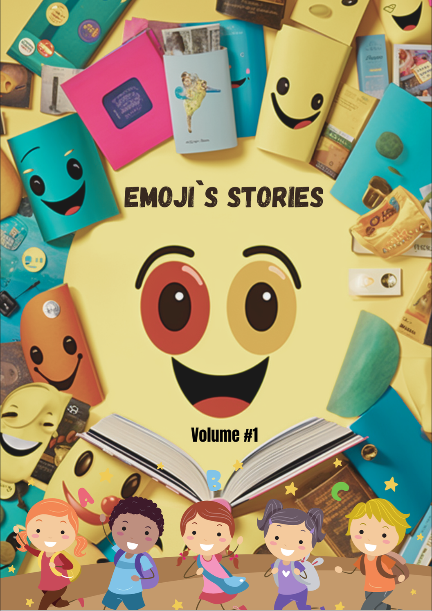
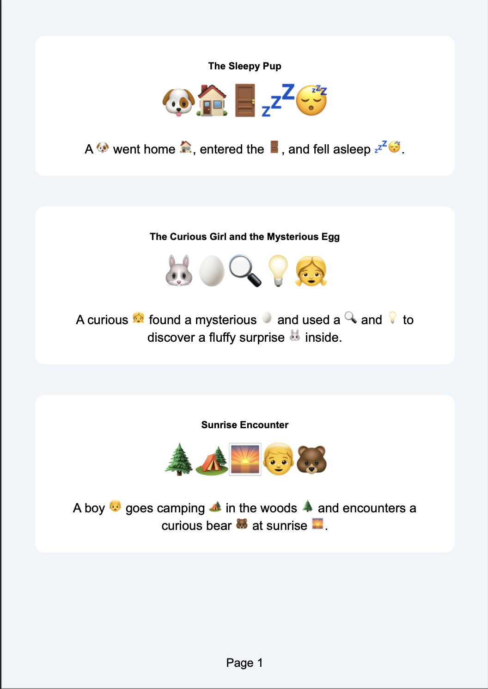

## Emoji Stories Book Generator

Simple idea and simple python scripts that uses prompt engineering and OpenAI APIs to generate a fully commercializable Emoji Stories book.

jinja2 and pdfkit are used to generate the PDF.

For the cover you can use whatever Text-To-Image Model (Dall-E, Midjourney, or open source once from HF)

## Examples of Book (For Children)

### Have Fun
